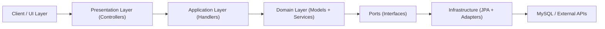
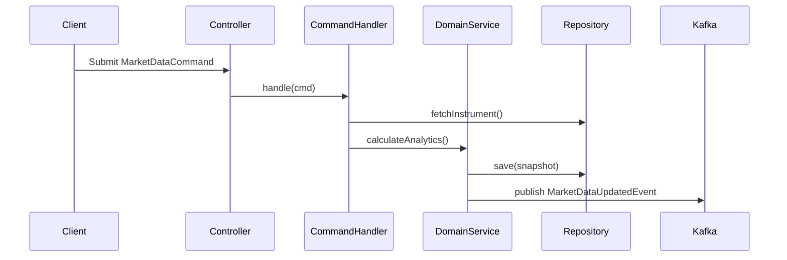
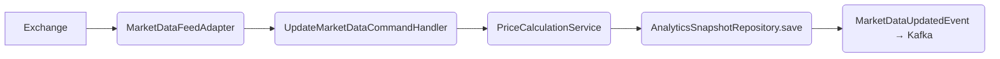
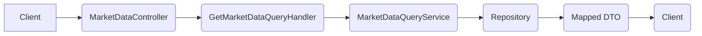

# IntelStream – High-Performance Real-Time Market Intelligence Platform ⚡📈

> A scalable, cleanly architected backend platform for real-time market data ingestion, analytics, and intelligent alerting.


---

## 🚀 Overview

**IntelStream** is a clean, modular backend platform for analyzing real-time market data (stocks, crypto, exchanges), generating technical indicators (RSI, Volatility, etc.), and exposing insights via APIs and WebSockets.

### 🧠 Core Responsibilities

- Collect raw market data in real-time.
- Calculate technical indicators like RSI, moving averages, and volatility.
- Expose data to client dashboards and alerting systems.
- Cleanly separate read vs write logic (CQRS).
- Domain-first architecture with clean layering and hexagonal boundaries.

---

## ✅ Features

- ⚙️ **Clean Architecture** (DDD + Hexagonal + CQRS)
- 📊 Real-Time **Analytics Engine** (RSI, MA, Volatility)
- 🧭 Command & Query Separation (CQRS)
- 🔌 Pluggable External APIs (Market Data Feeds, Notification Services)
- 🗃️ JPA with Mapper layer (Entity ↔ Domain separation)
- 🌐 REST + WebSocket APIs
- 📦 Fully testable, modular, and production-grade design

---

### 🧠 Architecture Overview

#### 🎯 Clean Hexagonal Architecture



#### 🎯 CQRS Command Flow



⚒️ Tech Stack
 
| **Layer**          | **Tech / Tools**                        |
| ------------------ | --------------------------------------- |
| **Language**       | Java 17                                 |
| **Framework**      | Spring Boot 3.x                         |
| **Database**       | MySQL                                   |
| **Real-Time**      | WebSockets                              |
| **Architecture**   | DDD, CQRS, Ports & Adapters (Hexagonal) |
| **Data Mapping**   | MapStruct / Manual Mappers              |
| **External Feeds** | REST Adapters for Exchange APIs         |
| **Build Tool**     | Maven                                   |
| **Caching**        | Spring Cache / Redis (optional)         |
| **Messaging**      | Kafka (planned for event streaming)     |


#### 📂 Project Structure
| **Layer**             | **Subfolder**                        | **Description**                                       |
| --------------------- | ------------------------------------ | ----------------------------------------------------- |
| 🟢 **Root**           | `MarketIntelligenceApplication.java` | Spring Boot main class                                |
| 🟦 **Infrastructure** | `config/`                            | Configuration classes (DB, Cache, Security, Async)    |
|                       | `persistence/entity/`                | JPA Entities (MarketData, Instrument, Exchange, etc.) |
|                       | `persistence/repository/`            | Spring Data JPA Repositories                          |
|                       | `persistence/mapper/`                | Entity ↔ Domain mappers                               |
|                       | `external/marketdata/`               | Integrations with Exchange APIs                       |
|                       | `external/notification/`             | Alert notifications adapter                           |
|                       | `messaging/`                         | Kafka publishers / consumers                          |
| 🟧 **Application**    | `command/handler/`                   | CQRS Command Handlers                                 |
|                       | `command/dto/`                       | Command DTOs                                          |
|                       | `command/service/`                   | Command Services                                      |
|                       | `query/handler/`                     | Query Handlers                                        |
|                       | `query/dto/`                         | Query DTOs & Responses                                |
|                       | `query/service/`                     | Query Services                                        |
|                       | `common/exception/`                  | Custom exceptions                                     |
|                       | `common/validation/`                 | Business validations                                  |
|                       | `common/mapper/`                     | DTO mappers                                           |
|                       | `port/in/`                           | Inbound ports/interfaces                              |
|                       | `port/out/`                          | Outbound ports/interfaces                             |
| 🟨 **Domain**         | `model/`                             | Core domain models                                    |
|                       | `service/`                           | Domain services (analytics, pricing)                  |
|                       | `repository/`                        | Domain repository interfaces                          |
|                       | `event/`                             | Domain events                                         |
| 🟪 **Presentation**   | `controller/`                        | REST controllers                                      |
|                       | `websocket/`                         | WebSocket endpoints                                   |
|                       | `dto/request/`                       | API request DTOs                                      |
|                       | `dto/response/`                      | API response DTOs                                     |
|                       | `mapper/`                            | API mappers                                           |
| 🟫 **Shared**         | `common/`                            | Utility classes (pagination, datetime)                |
|                       | `constants/`                         | System constants                                      |
|                       | `generic/`                           | Generic base classes                                  |


## 🚀 Getting Started with IntelStream

### ✅ Prerequisites

Before you begin, make sure you have the following installed:

* **Java 17+**
* **Maven 3.x**
* **MySQL** (Local or via Docker)
* *(Optional)* **Redis**
* *(Optional)* **Kafka**

---

### 📦 Clone & Run the Project

```bash
# Clone the repository
git clone https://github.com/Shubh00796/IntelStream-High-Performance-Real-Time-Market-Intelligence-Platform.git
cd IntelStream-High-Performance-Real-Time-Market-Intelligence-Platform

# Build and run the application
./mvnw clean install
./mvnw spring-boot:run
```

---

### 🛠️ Setup the Database

```sql
CREATE DATABASE market_intelligence;
```

Update your **`application.yml`** or **`DatabaseConfig.java`** with your database credentials:

```yaml
spring:
  datasource:
    url: jdbc:mysql://localhost:3306/market_intelligence
    username: root
    password: password
```

---

### 🐳 Optional: Run MySQL + Redis + Kafka in Docker

```yaml
# docker-compose.yml
version: '3.8'
services:
  mysql:
    image: mysql:8
    environment:
      MYSQL_ROOT_PASSWORD: password
      MYSQL_DATABASE: market_intelligence
    ports:
      - "3306:3306"

  redis:
    image: redis:latest
    ports:
      - "6379:6379"

  kafka:
    image: bitnami/kafka:latest
    environment:
      KAFKA_CFG_ZOOKEEPER_CONNECT: zookeeper:2181
      ALLOW_PLAINTEXT_LISTENER: "yes"
    ports:
      - "9092:9092"
  zookeeper:
    image: bitnami/zookeeper:latest
    ports:
      - "2181:2181"
```

---

### 📁 Sample Domain Model

```java
@Value
@Builder
public class AnalyticsSnapshot {
    Long instrumentId;
    BigDecimal movingAverage20;
    BigDecimal rsi;
    BigDecimal volatility;
    LocalDateTime timestamp;
}
```

---

### 📡 Planned API Endpoints

| Method | Path                    | Description                 |
| ------ | ----------------------- | --------------------------- |
| POST   | /api/market-data        | Ingest new market data      |
| GET    | /api/market-data/{id}   | Query specific market data  |
| GET    | /api/analytics/{symbol} | Fetch analytics snapshot    |
| GET    | /api/dashboard          | Summary for dashboard view  |
| WS     | /ws/market-data         | Real-time WebSocket updates |

---

### 🔄 Flowchart: How Data Flows (Ingestion)



### 📊 Flowchart: How Dashboard Works (Query)



---

### 🧩 Upcoming Enhancements

* ✅ Kafka-based event stream ingestion
* 🔁 Historical data sync & backtesting
* 📈 Risk modeling & scoring engine
* 🚨 Real-time anomaly detection
* ⚡ Redis caching for fast queries
* 📊 Prometheus / Grafana observability

---

### 🤝 Contribution Guide

We welcome contributions! To contribute:

```bash
# 1. Fork the repository
# 2. Create your feature branch
$ git checkout -b feature/amazing-feature

# 3. Make your changes and commit
$ git commit -m "feat: add amazing feature"

# 4. Push and raise a pull request
$ git push origin feature/amazing-feature
```

---

### 📜 License

This project is open-source and licensed under the **MIT License**.

---

### 📫 Questions?

Feel free to open an issue or reach out via GitHub Discussions.


