# IntelStream – High-Performance Real-Time Market Intelligence Platform ⚡📈

> A scalable, cleanly architected backend platform for real-time market data ingestion, analytics, and intelligent alerting.


---

## 🚀 Overview

**IntelStream** is a clean, modular backend platform for analyzing real-time market data (stocks, crypto, exchanges), generating technical indicators (RSI, Volatility, etc.), and exposing insights via APIs and WebSockets.

### 🧠 Core Responsibilities

- Collect raw market data in real-time.
- Calculate technical indicators like RSI, moving averages, and volatility.
- Expose data to client dashboards and alerting systems.
- Cleanly separate read vs write logic (CQRS).
- Domain-first architecture with clean layering and hexagonal boundaries.

---

## ✅ Features

- ⚙️ **Clean Architecture** (DDD + Hexagonal + CQRS)
- 📊 Real-Time **Analytics Engine** (RSI, MA, Volatility)
- 🧭 Command & Query Separation (CQRS)
- 🔌 Pluggable External APIs (Market Data Feeds, Notification Services)
- 🗃️ JPA with Mapper layer (Entity ↔ Domain separation)
- 🌐 REST + WebSocket APIs
- 📦 Fully testable, modular, and production-grade design

---

### 🧠 Architecture Overview

#### 🎯 Clean Hexagonal Architecture


#### 🎯 CQRS Command Flow


⚒️ Tech Stack
 
| **Layer**          | **Tech / Tools**                        |
| ------------------ | --------------------------------------- |
| **Language**       | Java 17                                 |
| **Framework**      | Spring Boot 3.x                         |
| **Database**       | MySQL                                   |
| **Real-Time**      | WebSockets                              |
| **Architecture**   | DDD, CQRS, Ports & Adapters (Hexagonal) |
| **Data Mapping**   | MapStruct / Manual Mappers              |
| **External Feeds** | REST Adapters for Exchange APIs         |
| **Build Tool**     | Maven                                   |
| **Caching**        | Spring Cache / Redis (optional)         |
| **Messaging**      | Kafka (planned for event streaming)     |


#### 📂 Project Structure
| **Layer**             | **Subfolder**                        | **Description**                                       |
| --------------------- | ------------------------------------ | ----------------------------------------------------- |
| 🟢 **Root**           | `MarketIntelligenceApplication.java` | Spring Boot main class                                |
| 🟦 **Infrastructure** | `config/`                            | Configuration classes (DB, Cache, Security, Async)    |
|                       | `persistence/entity/`                | JPA Entities (MarketData, Instrument, Exchange, etc.) |
|                       | `persistence/repository/`            | Spring Data JPA Repositories                          |
|                       | `persistence/mapper/`                | Entity ↔ Domain mappers                               |
|                       | `external/marketdata/`               | Integrations with Exchange APIs                       |
|                       | `external/notification/`             | Alert notifications adapter                           |
|                       | `messaging/`                         | Kafka publishers / consumers                          |
| 🟧 **Application**    | `command/handler/`                   | CQRS Command Handlers                                 |
|                       | `command/dto/`                       | Command DTOs                                          |
|                       | `command/service/`                   | Command Services                                      |
|                       | `query/handler/`                     | Query Handlers                                        |
|                       | `query/dto/`                         | Query DTOs & Responses                                |
|                       | `query/service/`                     | Query Services                                        |
|                       | `common/exception/`                  | Custom exceptions                                     |
|                       | `common/validation/`                 | Business validations                                  |
|                       | `common/mapper/`                     | DTO mappers                                           |
|                       | `port/in/`                           | Inbound ports/interfaces                              |
|                       | `port/out/`                          | Outbound ports/interfaces                             |
| 🟨 **Domain**         | `model/`                             | Core domain models                                    |
|                       | `service/`                           | Domain services (analytics, pricing)                  |
|                       | `repository/`                        | Domain repository interfaces                          |
|                       | `event/`                             | Domain events                                         |
| 🟪 **Presentation**   | `controller/`                        | REST controllers                                      |
|                       | `websocket/`                         | WebSocket endpoints                                   |
|                       | `dto/request/`                       | API request DTOs                                      |
|                       | `dto/response/`                      | API response DTOs                                     |
|                       | `mapper/`                            | API mappers                                           |
| 🟫 **Shared**         | `common/`                            | Utility classes (pagination, datetime)                |
|                       | `constants/`                         | System constants                                      |
|                       | `generic/`                           | Generic base classes                                  |


## 🚀 Getting Started with IntelStream

### ✅ Prerequisites

Before you begin, make sure you have the following installed:

* **Java 17+**
* **Maven 3.x**
* **MySQL** (Local or via Docker)
* *(Optional)* **Redis**
* *(Optional)* **Kafka**

---

### 📦 Clone & Run the Project

```bash
# Clone the repository
git clone https://github.com/Shubh00796/IntelStream-High-Performance-Real-Time-Market-Intelligence-Platform.git
cd IntelStream-High-Performance-Real-Time-Market-Intelligence-Platform

# Build and run the application
./mvnw clean install
./mvnw spring-boot:run
```

---

### 🛠️ Setup the Database

```sql
CREATE DATABASE market_intelligence;
```

Update your **`application.yml`** or **`DatabaseConfig.java`** with your database credentials:

```yaml
spring:
  datasource:
    url: jdbc:mysql://localhost:3306/market_intelligence
    username: root
    password: password
```

---

### 🐳 Optional: Run MySQL + Redis + Kafka in Docker

```yaml
# docker-compose.yml
version: '3.8'
services:
  mysql:
    image: mysql:8
    environment:
      MYSQL_ROOT_PASSWORD: password
      MYSQL_DATABASE: market_intelligence
    ports:
      - "3306:3306"

  redis:
    image: redis:latest
    ports:
      - "6379:6379"

  kafka:
    image: bitnami/kafka:latest
    environment:
      KAFKA_CFG_ZOOKEEPER_CONNECT: zookeeper:2181
      ALLOW_PLAINTEXT_LISTENER: "yes"
    ports:
      - "9092:9092"
  zookeeper:
    image: bitnami/zookeeper:latest
    ports:
      - "2181:2181"
```

---

### 📁 Sample Domain Model

```java
@Value
@Builder
public class AnalyticsSnapshot {
    Long instrumentId;
    BigDecimal movingAverage20;
    BigDecimal rsi;
    BigDecimal volatility;
    LocalDateTime timestamp;
}
```

---

### 📡 Planned API Endpoints

| Method | Path                    | Description                 |
| ------ | ----------------------- | --------------------------- |
| POST   | /api/market-data        | Ingest new market data      |
| GET    | /api/market-data/{id}   | Query specific market data  |
| GET    | /api/analytics/{symbol} | Fetch analytics snapshot    |
| GET    | /api/dashboard          | Summary for dashboard view  |
| WS     | /ws/market-data         | Real-time WebSocket updates |

---

### 🔄 Flowchart: How Data Flows (Ingestion)


### 📊 Flowchart: How Dashboard Works (Query)


---

### 🧩 Upcoming Enhancements

* ✅ Kafka-based event stream ingestion
* 🔁 Historical data sync & backtesting
* 📈 Risk modeling & scoring engine
* 🚨 Real-time anomaly detection
* ⚡ Redis caching for fast queries
* 📊 Prometheus / Grafana observability

---

### 🤝 Contribution Guide

We welcome contributions! To contribute:

```bash
# 1. Fork the repository
# 2. Create your feature branch
$ git checkout -b feature/amazing-feature

# 3. Make your changes and commit
$ git commit -m "feat: add amazing feature"

# 4. Push and raise a pull request
$ git push origin feature/amazing-feature
```

---

### 📜 License

This project is open-source and licensed under the **MIT License**.

---

### 📫 Questions?

Feel free to open an issue or reach out via GitHub Discussions.


---

## 🔒 New: Security, Caching, Resilience, Metrics (Production-grade)

The project now includes hardened, production-ready capabilities while adhering to SOLID/KISS/DRY and clean architecture principles. No existing content was removed; this section highlights the new additions.

- **Security (Spring Security 6, stateless)**
  - Permit: `/v3/api-docs/**`, `/swagger-ui.html`, `/swagger-ui/**`, `/api/public/**`
  - Roles: `/api/admin/**` → `ADMIN`, `/api/market-data/**` → `TRADER`, `/actuator/**` → `ADMIN`
  - CSRF disabled for stateless APIs, CORS enabled with `CorsConfigurationSource`
- **Caching (Redis)**
  - Read paths cached using `@Cacheable` with TTLs via `RedisCacheManager`
  - Write paths invalidate caches using `@CacheEvict` (prevents stale reads)
  - Cache names: `marketData`, `analytics`, `instruments`
- **Resilience (Resilience4j)**
  - Global defaults via beans and properties for `CircuitBreaker`, `Retry`, `TimeLimiter`
  - Applied annotations on read-heavy services (idempotent operations)
- **Observability (Micrometer + Prometheus)**
  - Actuator metrics exposed at `/actuator/prometheus`
  - Useful for Grafana dashboards and SLO monitoring
- **API Docs (springdoc-openapi)**
  - Swagger UI: `/swagger-ui/index.html`
  - OpenAPI JSON: `/v3/api-docs`

### 🧩 Architecture addendum (Resilience + Caching)

```mermaid
sequenceDiagram
    participant Client
    participant API as REST Controller
    participant SVC as Service (CQRS)
    participant CB as CircuitBreaker/Retry
    participant Cache as Redis Cache
    participant DB as MySQL

    Client->>API: GET /api/…
    API->>SVC: delegate()
    SVC->>Cache: @Cacheable get(key)
    alt cache hit
        Cache-->>SVC: value
        SVC-->>API: DTO
    else cache miss
        SVC->>CB: execute(supplier)
        CB->>DB: query
        DB-->>CB: rows
        CB-->>SVC: entities
        SVC->>Cache: put(key, value)
        SVC-->>API: DTO
    end
    API-->>Client: 200 OK
```



---

## ⚙️ Configuration (Environment-first)

All sensitive/configurable values can be set via environment variables. Sensible local defaults remain.

```properties
# Database
DB_URL=jdbc:mysql://localhost:3306/blogapplication?useSSL=false&serverTimezone=UTC&allowPublicKeyRetrieval=true
DB_USER=root
DB_PASSWORD=change_me

# Redis
REDIS_HOST=localhost
REDIS_PORT=6379

# Temporal (optional)
TEMPORAL_NAMESPACE=default
TEMPORAL_TARGET=localhost:7233
TEMPORAL_TASK_QUEUE=LOAN_PROCESSING_QUEUE
```

Relevant Spring properties (already set in `application.properties`):

```properties
management.endpoints.web.exposure.include=health,info,metrics,prometheus
management.endpoint.health.show-details=when_authorized
```

---

## 🔍 Endpoints (Docs, Health, Metrics)

- **Swagger UI**: `http://localhost:7777/swagger-ui/index.html`
- **OpenAPI JSON**: `http://localhost:7777/v3/api-docs`
- **Actuator (Prometheus)**: `http://localhost:7777/actuator/prometheus`
- **Health**: `http://localhost:7777/actuator/health`

Note: Security restrictions apply. `ADMIN` role is required for `/actuator/**` except where exposure is configured.

---

## 🧠 Defaults and Policies

- **Caching strategy**
  - `instruments`: long-lived, entity lookups (keys: `id:{id}`, `symbol:{symbol}`, `exchange:{id|code}`)
  - `analytics`: medium TTL for computed snapshots
  - `marketData`: short TTL for near real-time data
  - Writes (`create/deactivate/update/bulk`) perform `@CacheEvict(allEntries = true)` on affected caches

- **Resilience defaults** (overridable per instance)
  - CircuitBreaker: 50% failure rate, 10-size window, min 5 calls, 60s open-state wait
  - Retry: 3 attempts, 100ms backoff
  - TimeLimiter: 5s timeout

- **Transactions**
  - Command services use `@Transactional(isolation = READ_COMMITTED)`
  - Query services opt into read-only where applicable

---

## 🚀 Running with Redis (optional but recommended)

```bash
# Using Docker
docker run --name redis -p 6379:6379 -d redis:7

# Verify locally
redis-cli -h localhost -p 6379 ping  # -> PONG
```

The application will auto-connect using `spring.data.redis.*` properties.

---

## ✅ Build/Run Quickstart (updated)

```bash
mvn clean package -DskipTests
mvn spring-boot:run

# URLs
# Swagger:      http://localhost:7777/swagger-ui/index.html
# OpenAPI:      http://localhost:7777/v3/api-docs
# Prometheus:   http://localhost:7777/actuator/prometheus
```

---

## 📌 Notes

- The repo now includes dependencies for: Spring Security, Spring Data Redis, Resilience4j, Micrometer Prometheus, and springdoc-openapi.
- If you deploy in environments that enforce Java 17 LTS, the codebase remains compatible. The Maven `java.version` may be set higher; align to 17 if required by your runtime.